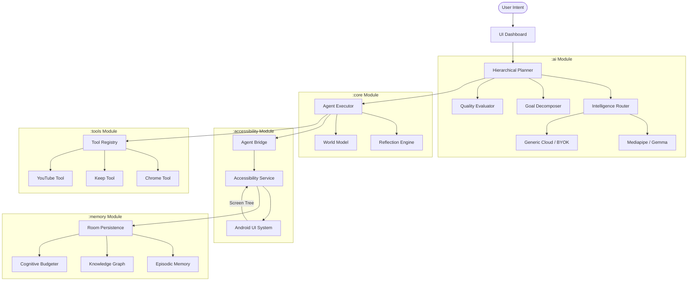

# Architecture: Android Local Agent OS

## Overview
A local-first agentic operating system layer for Android that autonomously controls applications through Accessibility Services.

## Modular Responsibilities

### 1. :ai (Intelligence Layer)
- **Planning:** Converts natural language into hierarchical subgoal trees.
- **Routing:** Dynamically selects the best LLM based on privacy, cost, and complexity.
- **Reasoning:** Local-first inference using Mediapipe GenAI.

### 2. :accessibility (Control Layer)
- **Interaction:** Executes clicks, scrolls, and text input.
- **Understanding:** Flattens the Accessibility Node Tree into a semantic UI model.
- **Stability:** Implements strict node recycling to prevent system leaks.

### 3. :core (Engine Layer)
- **Execution:** Manages the **Plan → Execute → Observe → Verify → Reflect** feedback loop.
- **Belief Revision:** Dynamically updates trust scores based on new evidence.
- **Economics:** Tracks time saved and ROI for agentic workflows.

### 4. :memory (Persistence Layer)
- **Graph:** Stores long-term entities and relationships.
- **Episodes:** Retains successful interaction patterns for future reuse.
- **Integrity:** Tracks provenance and evidence for every knowledge claim.

### 5. :tools (Integration Layer)
- **Specialization:** Provides app-specific logic and success verification for target applications.

### 6. :app (Interface Layer)
- **Transparency:** Displays live logs, cognitive health, and strategic intelligence dashboards.
